# E2E-Realtime-Data-Engineer-1
E2E Realtime Data Engineering Project | With Airflow, Potsgree, Kafka, Spark &amp; Cassandra With Process Into Docker Compose

## Architecture System

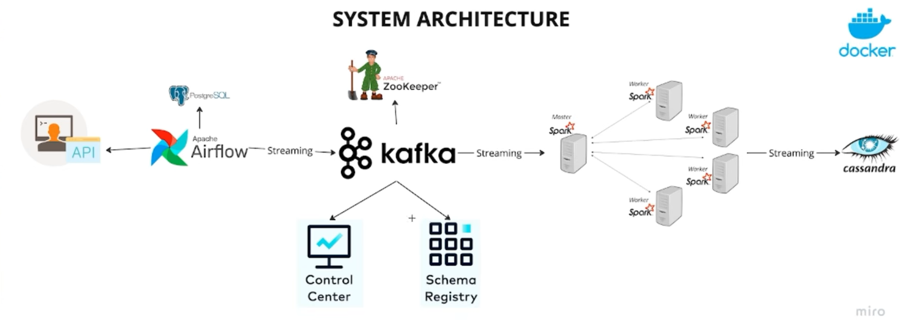

## Introduction

This project serves as a comprehensive guide to building an end-to-end data engineering pipeline and ETL Coseption. It covers each stage from data ingestion to processing and finally to storage, utilizing a robust tech stack that includes Apache Airflow, Python, Apache Kafka, Apache Zookeeper, Apache Spark, and Cassandra. Everything is containerized using Docker for ease of deployment and scalability.

## Deep Learn
- Setting up a data pipeline with Apache Airflow
  1. Conf_inisialize_put_data_from_airflow_to_kafka
   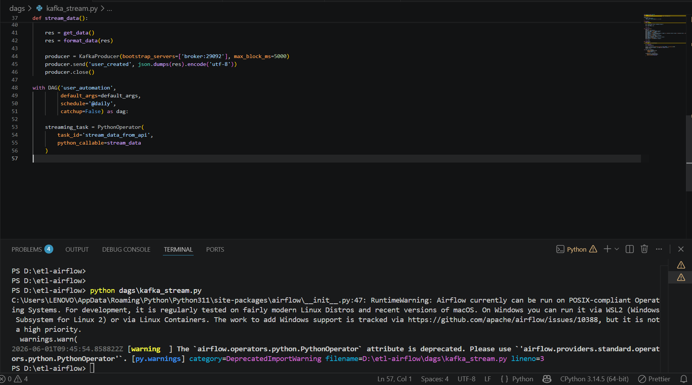

  2. Inisialize_put_data_from_airflow_to_kafka_DAG_airflow
   
- Real-time data streaming with Apache Kafka
  1. 
- Distributed synchronization with Apache Zookeeper
  1. Sync_zookeeper_control-center_&_schema_registry_on_Kafka
  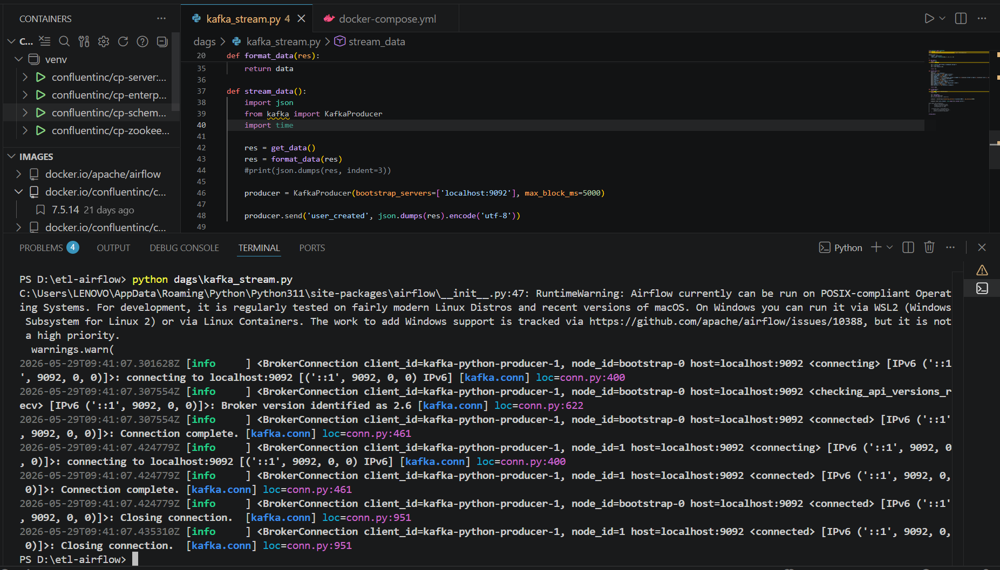

  2. Result_zookeeper_control-center__schema_registry_on_Kafka
   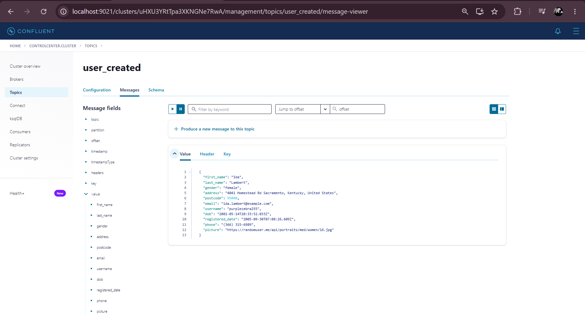

- Data processing techniques with Apache Spark
  1. Inisialize_spark_worker-spark_master_&_cassandra
   

- Data storage solutions with Cassandra and PostgreSQL
  1. Set_config_in_spark_job_to_create_key_spaces&table&insert_data_from_arflow_to_cassandra
   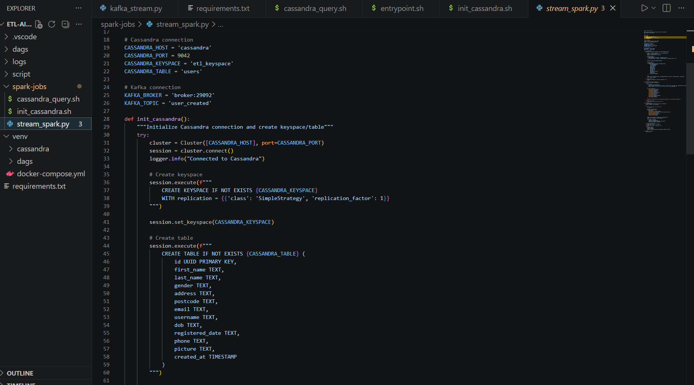

  2. Postgree
   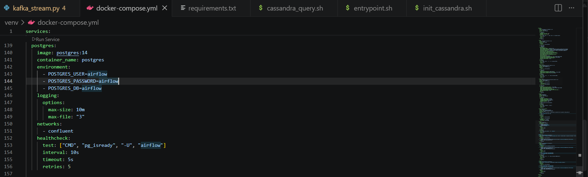

- Containerizing your entire data engineering setup with Docker
  1. Docker Images
   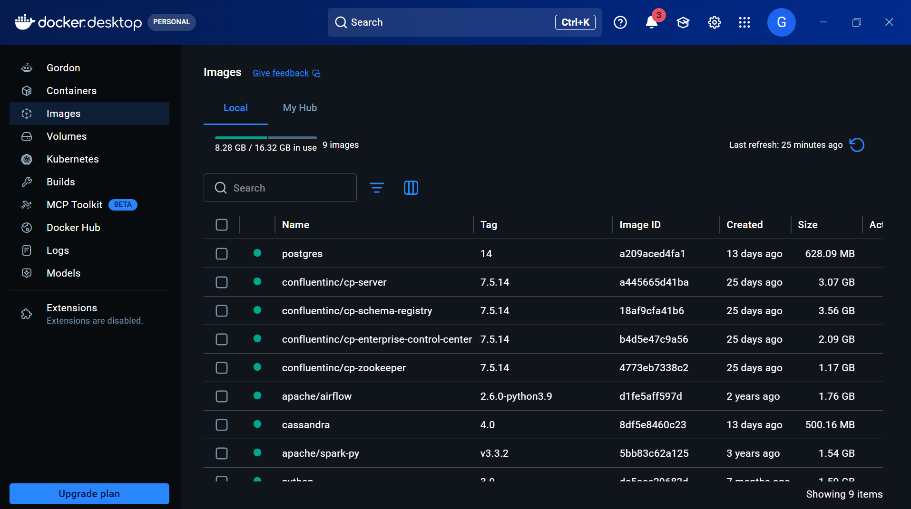

  2. Docker Container
   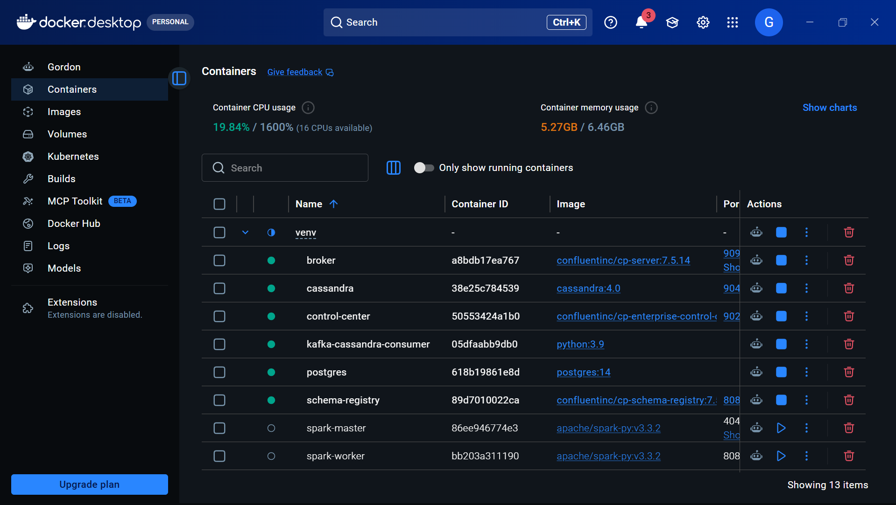

  3. Docker Compose Set-Up
   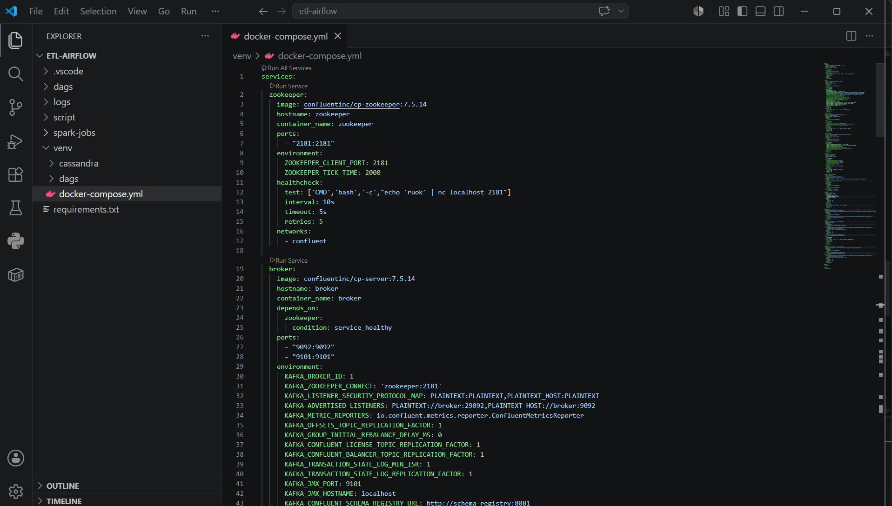
   
- Result
  1. Success_create_key_spaces&table
   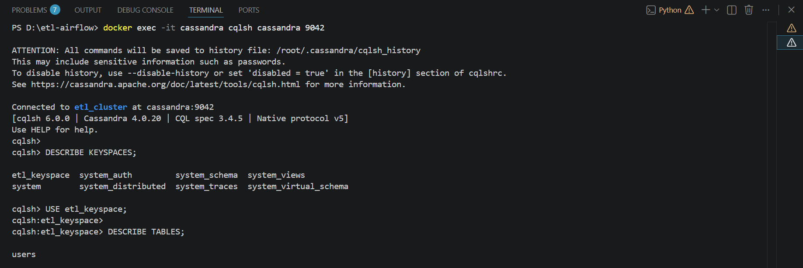
   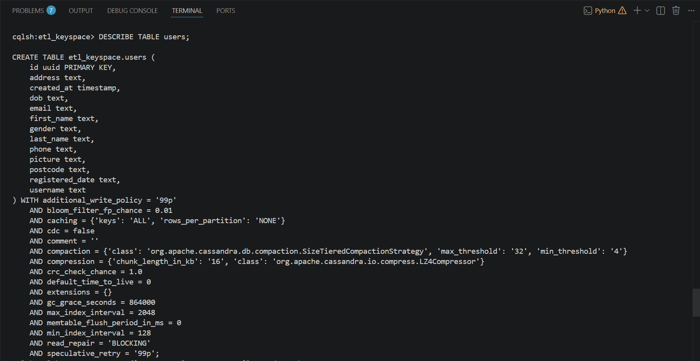

  2. Data_success_load_from_airflow_kafka&spark_to_cassandra
   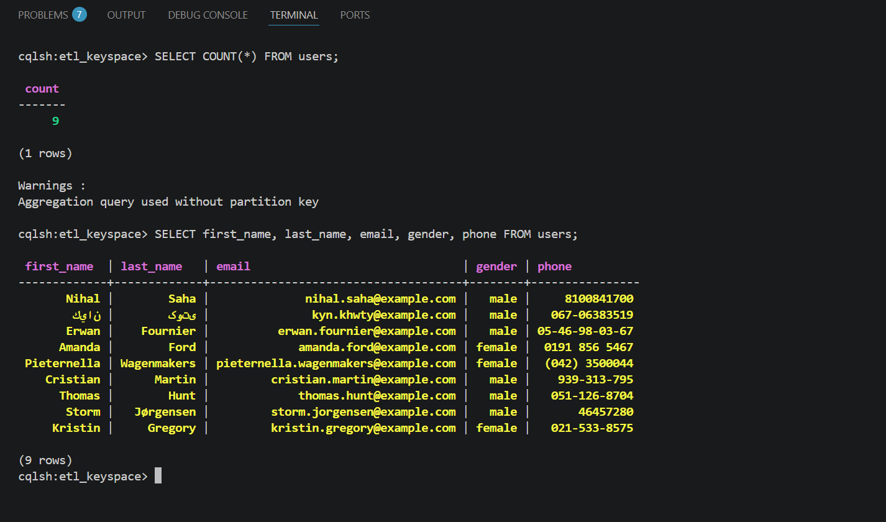

### Thanks